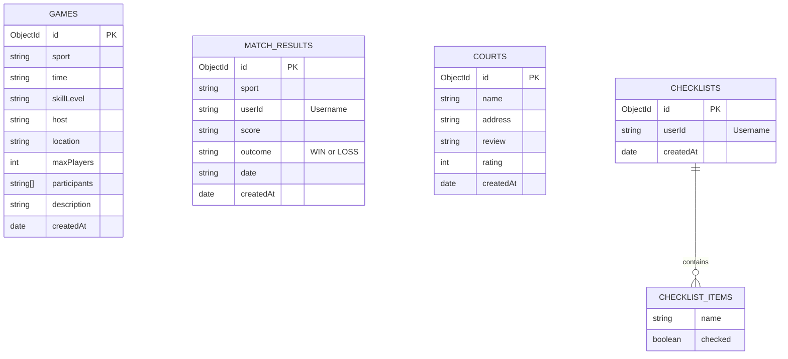

# Project 3: Design Document — CourtSide

## 1. Project Description
CourtSide is a full-stack, data-driven web application for sports lovers. It facilitates coordinating local pickup games, logging match history to track wins/losses, discovering local courts, and organizing gear checklists. It is backed by a Node.js/Express backend server, a MongoDB database, and a React frontend client.

---

## 2. User Personas

### Persona 1: Alex (The Social Athlete)
- **Background**: A local 24-year-old basketball player who recently moved to Boston and is looking for competitive or friendly pickup games.
- **Goals / Needs**: Wants to quickly find local pickup games that match their skill level (intermediate/advanced) without spending hours coordinating on social media groups.
- **Pain Points**: Coordination on generic chat apps is messy, and showing up to a court only to find it empty or filled with beginners is frustrating.

### Persona 2: Taylor (The Competitive Tracker)
- **Background**: A 28-year-old active tennis and pickleball player who plays multiple times a week.
- **Goals / Needs**: Wants to log game scores and outcomes (wins/losses) immediately after a game to maintain a clean record of personal performance and win rate over time.
- **Pain Points**: Keeping track of scores in notebook apps or spreadsheets is tedious and doesn't provide visual stats (like win-loss ratios).

### Persona 3: Jordan (The Community Recommender)
- **Background**: A 35-year-old pickleball enthusiast who loves discovering new public parks and facilities.
- **Goals / Needs**: Wants to add sports court locations with a short review comment and a rating so others can easily find high-quality local courts with nice amenities.
- **Pain Points**: General map apps do not specify court conditions (e.g., surface quality, net conditions, lighting) or focus on player reviews.

### Persona 4: Morgan (The Forgetful Player)
- **Background**: A busy 22-year-old college student who rushes from classes to recreational sports games.
- **Goals / Needs**: Wants to manage a checklist of sports equipment (shoes, rackets, balls, water bottle) to tick off before leaving the house.
- **Pain Points**: Routinely leaves critical equipment (like extra grips or a water bottle) behind when rushing out the door.

---

## 3. User Stories

### Partner A Features (@Harini Thirunavukkarasan)
- **Social Matching**: As Alex, I want to post a new pickup game request with the sport type, time, and preferred skill level so that I can find other people to play with at my level.
- **Personal Tracking**: As Taylor, I want to log my game score and match outcome (win or loss) after playing so that I can track my personal performance history.

### Partner B Features (@Wu Hung Hsiao — Your Focus)
- **Location Directory**: As Jordan, I want to add a sports court location with a short review comment and rating so that I can recommend good local places to others.
- **Gear Checklist**: As Morgan, I want to create a packing checklist for my sports equipment so that I do not forget anything before leaving for a game.

---

## 4. Use Cases

### Use Case 1: Organizing and Joining a Pickup Game (Alex)
1. **Actor**: Alex (Social Athlete)
2. **Pre-conditions**: Alex is logged in with their persona profile.
3. **Flow of Events**:
   - Alex navigates to the **Create Game** page.
   - Alex fills out the form: chooses "Basketball", sets the time to "Tonight at 6:00 PM", selects "Intermediate", enters the location "Boston Common", and clicks "Create Game".
   - The game is inserted into the MongoDB database and immediately appears on the **Game Feed** page.
   - Another player (e.g. Jordan) browses the feed, filters by "Basketball" and "Intermediate", sees Alex's game, and clicks "Join Game".
   - The system adds Jordan's username to the game participants list in MongoDB and updates the active player count on the card.

### Use Case 2: Logging a Score and Tracking History (Taylor)
1. **Actor**: Taylor (Competitive Tracker)
2. **Pre-conditions**: Taylor has completed a pickup game.
3. **Flow of Events**:
   - Taylor goes to the **Match History** page.
   - Taylor clicks **Add New Result**.
   - A modal opens, prompting Taylor to select the completed game or enter details (Sport, Date), enter the Score (e.g., "21 - 16"), and select the Result ("WIN").
   - Taylor clicks **Save Result**.
   - The result is written to MongoDB and the frontend recalculates and updates the stats cards (Total Games, Wins, Losses, Win Rate: 100%).

### Use Case 3: Recommending a Court (Jordan)
1. **Actor**: Jordan (Community Recommender)
2. **Pre-conditions**: Jordan visited a newly opened pickleball court.
3. **Flow of Events**:
   - Jordan navigates to the **Court Directory** page.
   - Jordan clicks **Add a Court**.
   - Jordan fills out the form: Court Name ("Carter Playground"), Address ("Boston, MA"), Rating (5 stars), and Review ("Brand new pickleball court. Lights turn off at 10 PM. Parking is easy.").
   - Jordan clicks **Save**.
   - The new court is saved to MongoDB and immediately renders in the directory list.

### Use Case 4: Managing a Gear Checklist (Morgan)
1. **Actor**: Morgan (Forgetful Player)
2. **Pre-conditions**: Morgan has a game scheduled in 30 minutes.
3. **Flow of Events**:
   - Morgan navigates to the **Gear Checklist** page.
   - Morgan selects their "Basketball Checklist".
   - Morgan sees the checklist items (Basketball Shoes, Water Bottle, Basketball).
   - As Morgan packs each item, they click the item's checkbox to toggle it to "checked".
   - The state is saved in MongoDB.
   - Realizing they need a towel, Morgan types "Towel" in the "Add Item" input and clicks "+".
   - The towel is added to the checklist in the database and immediately renders.

---

## 5. Database Schema & ER Diagram

CourtSide uses four collections in MongoDB: `games`, `match_results`, `courts`, and `checklists`. Below is the Entity-Relationship structure:

---

## 6. Wireframes & Mockups
The wireframe layout grids and full page layouts are structured in [Mockup.md](Mockup.md), outlining the responsive UI elements and navigation hierarchy.
