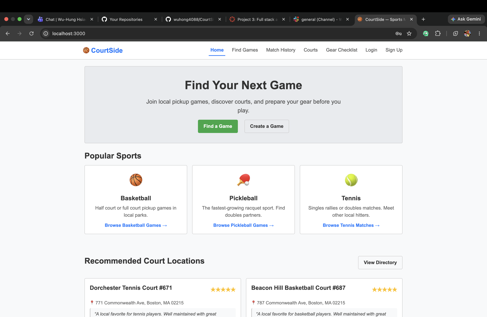

# CourtSide — Sports Matcher & Court Tracker

A modern full-stack web application designed for sports lovers to organize pickup games, log match results, discover sports courts, and manage packing checklists.

**Members**: 
- **Partner A**: @Harini Thirunavukkarasan (Social Matching & Personal Tracking)
- **Partner B**: @Wu Hung Hsiao (Location Directory & Gear Checklist)

**Class Link**: [CS 5610 Web Development](https://johnguerra.co/classes/webDevelopment_online_summer_2026/)  
**Public Page (Deployed URL)**: [https://courtside-8uiv.onrender.com](https://courtside-8uiv.onrender.com)  
**Slides**: *TBD*  
**Video Demo**: *TBD*

---

## Screenshots



| Feature | Screenshot |
|---|---|
| Find Pickup Games — browse, search, and filter |  |
| Find Pickup Games — logged in, showing "Joined" state and Leave Game |  |
| Match History — stats and win/loss log |  |
| Court Directory (Partner B) |  |
| Gear Checklist (Partner B) |  |

---

## Project Objective

CourtSide helps sports enthusiasts stay active and organized. The application coordinates local pickup games for sports like basketball and pickleball, tracks player match statistics, recommends local courts with reviews, and provides interactive packing checklists to ensure no gear is left behind before heading out.

---

## Short User Personas

- **Alex (The Social Athlete)**: A local basketball player who wants to quickly find others at their skill level for pickup games in the area.
- **Taylor (The Competitive Tracker)**: An active sports player who wants to log scores, wins, losses, and analyze personal performance metrics over time.
- **Jordan (The Community Recommender)**: A pickleball enthusiast who wants to review, rate, and recommend local court locations to help others find quality places to play.
- **Morgan (The Forgetful Player)**: A busy recreational player who frequently forgets equipment and needs a simple pre-game checklist to verify gear before leaving.

---

## User Stories

### Partner A (@Harini Thirunavukkarasan) — Social Matching & Personal Tracking
- **As Alex**, I want to post a new pickup game request with the sport type, time, and preferred skill level so that I can find other people to play with at my level.
- **As Taylor**, I want to log my game score and match outcome (win or loss) after playing so that I can track my personal performance history.

### Partner B (@Wu Hung Hsiao) — Location Directory & Gear Checklist
- **As Jordan**, I want to add a sports court location with a short review comment and rating so that I can recommend good local places to others.
- **As Morgan**, I want to create a packing checklist for my sports equipment (like shoes or rackets) so that I do not forget anything before leaving for a game.

---

## Work Distribution (Independent)

### Partner A (@Harini Thirunavukkarasan)
- **Data Models**:
  - `Game` (sport, time, skill level, host, location, max players, participants, description)
  - `MatchResult` (sport, score, outcome, date, linked to user)
- **API Endpoints**:
  - `GET /api/games` (with search, sport, and skill level filters)
  - `POST /api/games`
  - `PUT /api/games/:id`
  - `DELETE /api/games/:id`
  - `POST /api/games/:id/join`
  - `POST /api/games/:id/leave`
  - `GET /api/matches/:userId`
  - `POST /api/matches`
  - `PUT /api/matches/:id`
  - `DELETE /api/matches/:id`
- **Frontend Views**:
  - Game posting form (Create Game)
  - Game feed/browse view with join and leave (Find Games)
  - Personal match history view with computed win/loss stats (Match History)

### Partner B (@Wu Hung Hsiao)
- **Data Models**:
  - `CourtLocation` (name, address, review comment, rating)
  - `GearChecklist` (item list, checked/unchecked state, linked to user)
- **API Endpoints**:
  - `POST /api/courts`
  - `GET /api/courts`
  - `POST /api/checklist`
  - `GET /api/checklist/:userId`
- **Frontend Views**:
  - Court directory/list view with reviews and ratings
  - Interactive gear checklist creation/editing view

---

## Tech Stack

- **Frontend**: React (Functional Components, Hooks), React Router (`react-router-dom`), Vanilla CSS (Modular, responsive layout with gradients and animations).
- **Backend**: Node.js + Express (strictly ES Modules).
- **Database**: MongoDB (Native Driver).
- **Quality Tools**: ESLint, Prettier.

---

## Build And Run Instructions

### Prerequisites
- Node.js (version >= 18.0.0)
- A running MongoDB instance

### 1. Clone & Set Up Directory
```bash
git clone <repository_url>
cd CourtSide
npm install
```

### 2. Configure Environment Variables
Create a `.env` file in the root directory:
```ini
MONGO_URI=mongodb+srv://<username>:<password>@cluster.mongodb.net/courtside
PORT=5000
SESSION_SECRET=<any long random string>
```

### 3. Seed Database
This script inserts default mockup data for games, match results, courts, and checklists:
```bash
npm run seed
```

### 4. Run the Server (Concurrently)
To run both the Express backend and the Vite React frontend in development mode:
```bash
npm run dev
```
Open `http://localhost:3000` in your browser (Vite will pick the next free port, e.g. `3001`, if 3000 is already in use — check your terminal output for the exact URL).

### 5. Developer Quality Checks
```bash
# Run ESLint check
npm run lint

# Format code with Prettier
npm run format
```

---

## Design Document & Mockups
The full planning documentation is detailed in:
- **Design Document**: [docs/DESIGN_DOCUMENT.md](docs/DESIGN_DOCUMENT.md) (includes database schemas, ER diagrams, personas, and use cases).
- **Mockups**: [docs/Mockup.md](docs/Mockup.md) (includes interactive page ASCII wireframes).

---

## Final Project Extension
- **Gear Marketplace**: A joint stretch goal allowing users to list, sell, or rent used sports equipment, once both core features (A and B) are fully integrated and functional.

---

## GenAI Disclosure
Generative AI was used as an assistant to design, structure, and debug code and documentation, verifying compliance with the project specifications and course rubric.

---

## License
This project is licensed under the MIT License - see the [LICENSE](LICENSE) file for details.
